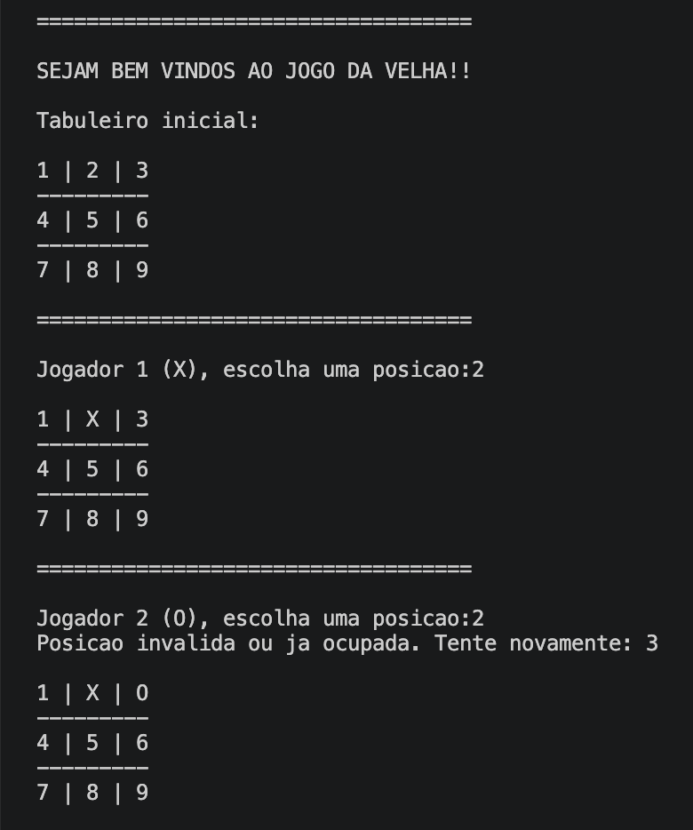
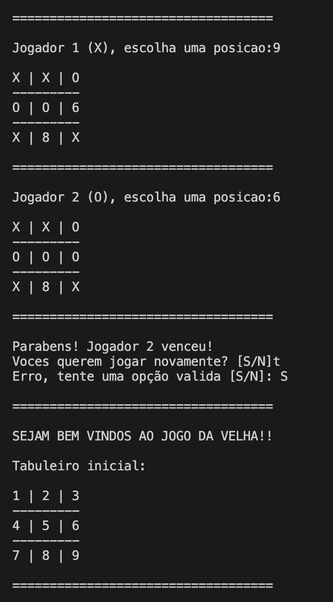

# jogo-da-velha

### Descrição

O jogo da velha é muito conhecido e ajuda as pessoas a passarem o tempo, decidirem coisas, etc. Aqui, temos um jogo da velha que pede ao jogador da vez qual posição ele quer ocupar. Se a opção escolhida já estiver ocupada ou for inválida, o programa pede outra posição ao usuário sem passar a vez ao outro, assim, é garantido um jogo justo e dinâmico. Após cada jogada. O tabuleiro é atualizado automaticamente e exibido na tela, além de que o programa verifica vitórias após todas as rodadas, quando alguém vence, é exibido uma mensagem de parabéns e quando ocorre um empate, é exibido uma mensagem de empate. Após cada rodada, os jogadores têm a oportunidade de jogarem mais vezes, sem precisar rodar novamente o programa.

### Capturas de tela

<p align="center">
  
  
</p>

### Instalação e Pré-requisitos

1. No terminal, digite:
   
   ```
   git clone https://github.com/elfisicoooo/jogo-da-velha
   cd jogo-da-velha
   ```

2. Após isso, compile com:
   
   ```
   gcc main.c -o jogo-da-velha
   ```

3. Por fim, rode com:
   
   Windows:
   ```
   jogo-da-velha.exe
   ```
   Linux/macOS:
   ```
   ./jogo-da-velha
   ```

### Usos e exemplos

Ao rodar o programa, é exibido uma mensagem de boas vindas e o tabuleiro inicial. A partir disso, o programa alterna entre os jogadores pedindo que eles escolham qual posição do tabuleiro eles querem ocupar. Caso algum usuário escolha uma opção inválida (por não estar no intervalo correto, estar já ocupada ou não ser um número), o programa continua pedindo até uma opção válida ser inserida, e só depois disso passa a vez ao outro jogador. 

No momento em que um jogador ganha, é exibida uma mensagem de parabéns, mas se houver empate, é exibida uma mensagem de empate. Depois que o jogo acaba, o programa pergunta se querem continuar, e caso a resposta for positiva (s ou S), o jogo reinicia, se for negativa (n ou N), o jogo acaba, e se for qualquer outra coisa, aparece uma mensagem de erro pedindo que os usuários insiram outra opção.

### Estrutura do projeto

```
jogo-da-velha/  
│── main.cpp 
│── LICENSE
│── README.md  
└── imagens/  
    ├── Demonstração1.png
    └── Demonstração2.png
```

O arquivo main.cpp contém todo o código do jogo, LICENSE.md contém a licença e o diretório imagens/ contém fotos de demonstrações do uso do programa.

## Licença  

Este projeto está licenciado sob a MIT License - veja o arquivo [LICENSE](LICENSE) para mais detalhes.  
